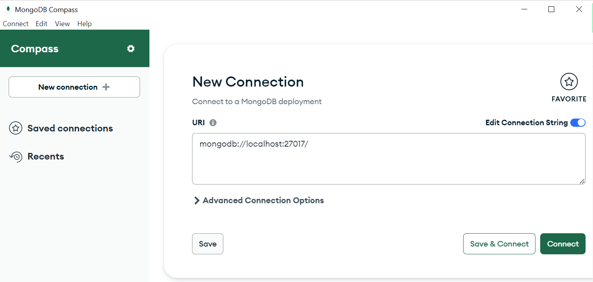
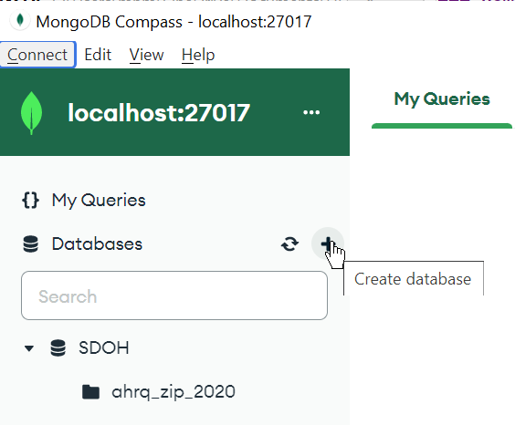
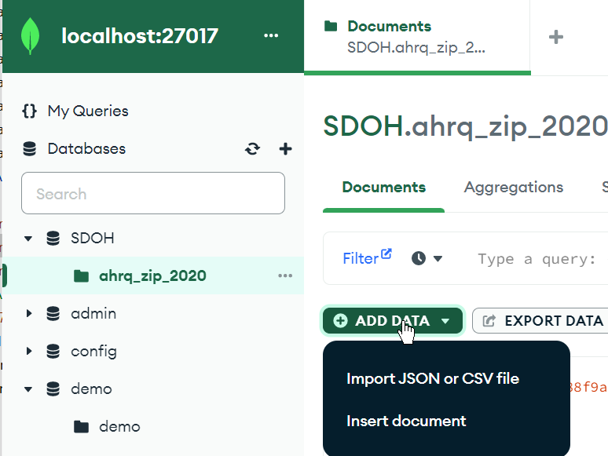
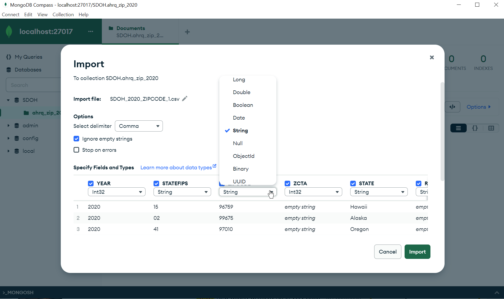
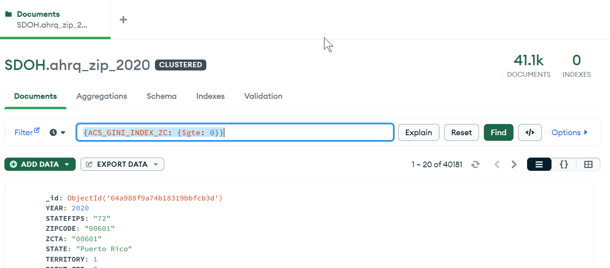

### Download and Run MongoDB

```shell
docker pull mongo:6.0.7
```
Launch the server
```shell
docker run --name mongodb -d -p 27017:27017  mongo:6.0.7
```

### Download and install MongoDB Compass

Compass is the GUI for MongoDB.
Download Compass for your OS.
[https://www.mongodb.com/try/download/compass](https://www.mongodb.com/try/download/compass)

Click connect


Create new database and under the database create a new collection



In the screenshot above we created a database called `SDOH` and collection `ahrq_zip_2020`

Click on your collection name on the left and then click the Add Data button. 


Change the field type to `String` for the following fields 
`"ZIPCODE", "ZCTA","STATEFIPS"`, then click the Import button.


### Exploring the data
Enter the following filter to the filter textbox.
```shell
{ACS_GINI_INDEX_ZC: {$gte: 0}}
```
