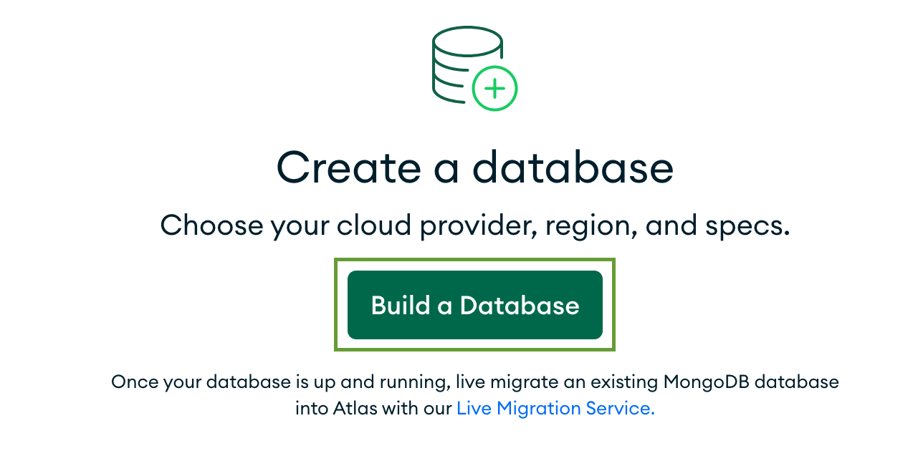
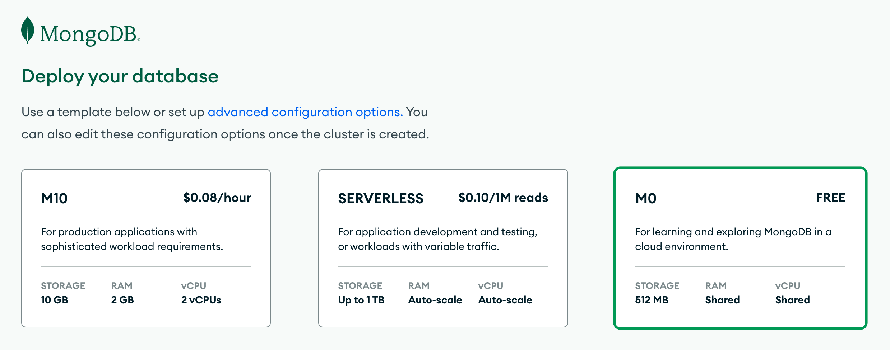
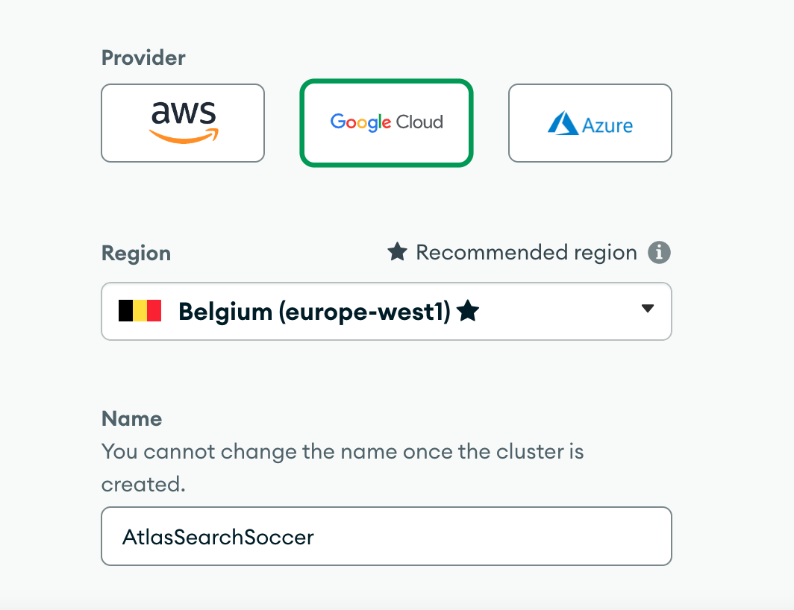
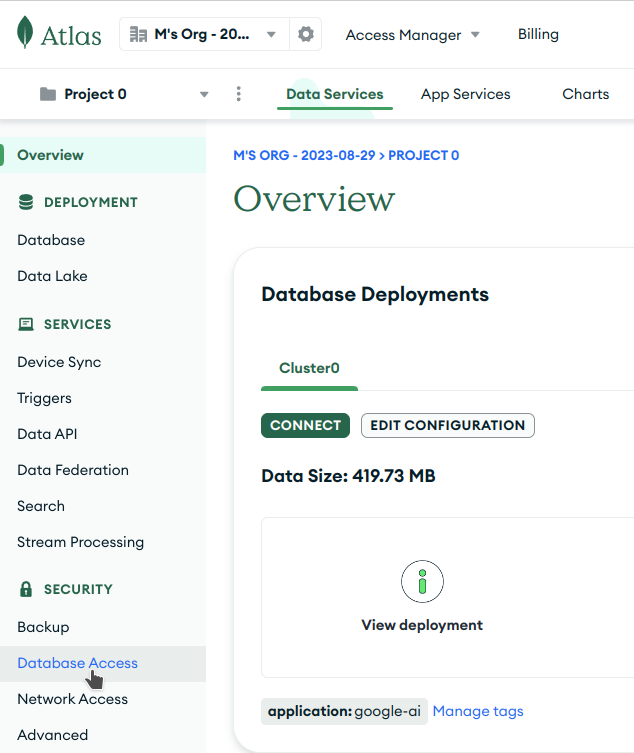
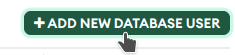
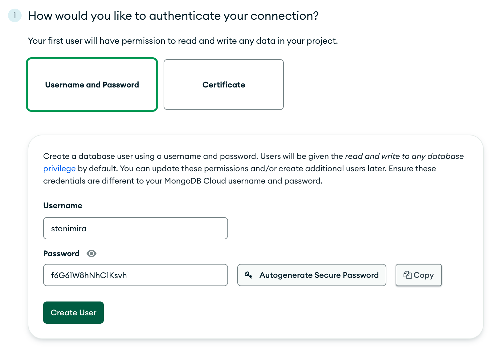
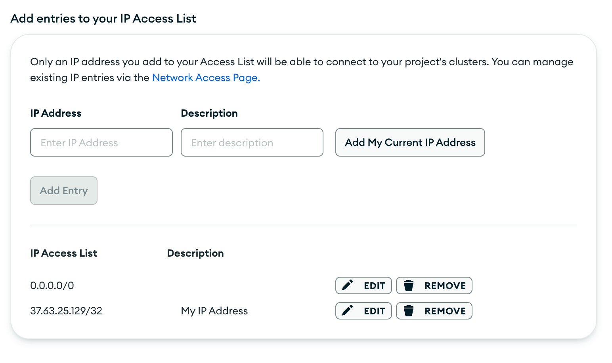

### Get started with MongoDB Atlas
MongoDB Atlas is a data platform, designed for developers, which inte
grates a multi-cloud database with various data services. It simplifies the process of database deployment and management while facilitating the development of modern data-driven applications.

The MongoDB Atlas registration is completely free and doesn't require a credit card. Follow the link below and create your account:

[Sign up for MongoDB Atlas](https://www.mongodb.com/atlas/database)

## Deploy a cloud database

Next, deploy your forever-free cloud database in MongoDB Atlas.

1. Click on the **Build a Database** button.

2. Select **M0** — the free shared tier.

3. Select a cloud provider and a region close to you. Rename your database to **SearchParty**.

4. Click **Create** to deploy your database.
## Load Sample Dataset

From the Atlas UI page, find the button with the three dots on the right side of your cluster and click on it. Then click on the "Load Sample Dataset" option.

  
This will load approximately 300 Mb of data into your cluster. It may take a few minutes to complete.

## Security quickstart

:::info
By default your Atlas deployment is completely locked down. To access it, you need to create access credentials and configure network access.
The access is under the Security menu group
:::
To create a database user navigate to **Database Access** 

and click on the 
1. To create a database user, provide secure credentials and click **Create User**.

 2. Next, configure the IP address list. Only connections coming from the allow-listed IPs will be accepted. You should see that your IP address was added by default.  Additionally, add the address `0.0.0.0/0` which allows access from anywhere and click **Add Entry**.

3. Finally, click **Finish and Close** and then, **Go to Databases**.