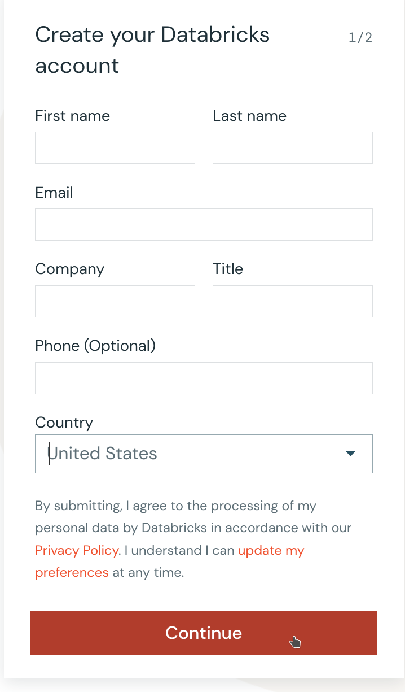
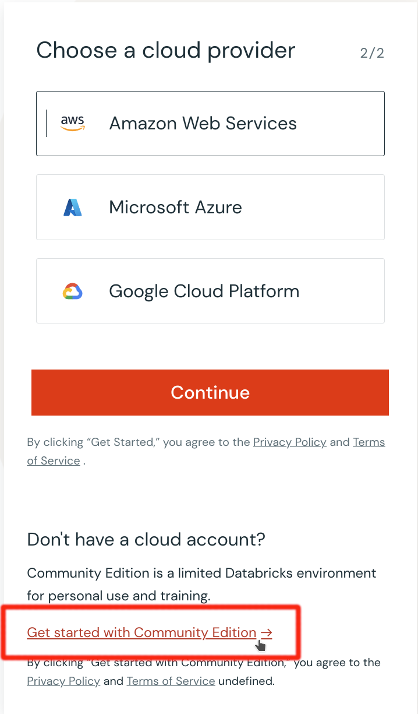

# Databricks

We will use the community edition  https://community.cloud.databricks.com/
which offers free Spark clusters with no time limit.

### Signup for Databricks community Edition
At the signup page  https://www.databricks.com/try-databricks

Fill out the form and click continue

On the next screen **DO NOT SELECT CLOUD PROVIDER**.  
click on the link at the bottom of the form <ins>Get started with Community Edition</ins>
You will be emailed a verification link and from there you will setup your credentials.  

The signup documentation  

[https://docs.databricks.com/en/getting-started/community-edition.html](https://docs.databricks.com/en/getting-started/community-edition.html#:~:text=Click%20Try%20Databricks%20here%20or,to%20the%20address%20you%20provided)

### External Connectors

Data bricks allows integration with many popular external data sources.
For example here is how we connect to MongoDB.
https://docs.databricks.com/en/external-data/mongodb.html

We will build an entirely cloud based data pipeline Managed by databricks and putting data on the MongoDB Atlas service.

### Quick Tutorials on ETL
https://docs.databricks.com/en/getting-started/etl-quick-start.html

### Sample datasets 
There are datasets that can be used directly from your Databricks workspace.
https://docs.databricks.com/en/dbfs/databricks-datasets.html
Introduction on Sample Datasets
https://databricks-prod-cloudfront.cloud.databricks.com/public/4027ec902e239c93eaaa8714f173bcfc/7567016051051197/2957017482322847/7192593576348604/latest.html

### Databricks notebook
Notebook with code for importing data from Chicago Data Portal to MongoDB Atlas 
published here
https://databricks-prod-cloudfront.cloud.databricks.com/public/4027ec902e239c93eaaa8714f173bcfc/7567016051051197/1979567446034704/7192593576348604/latest.html

