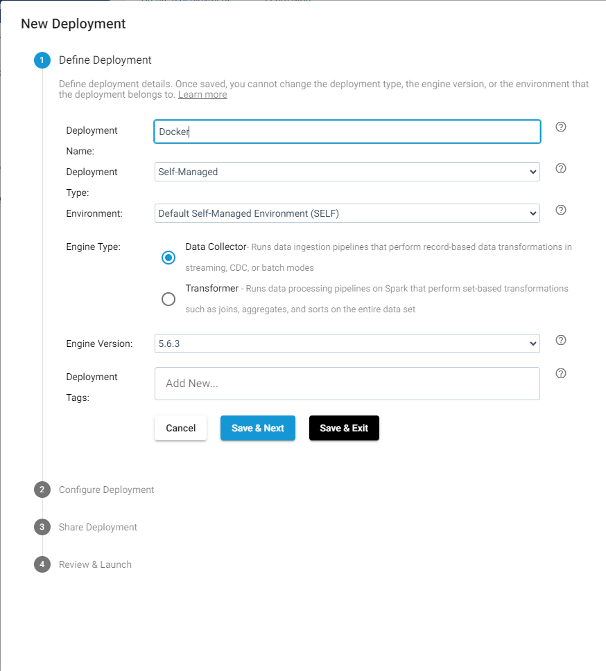
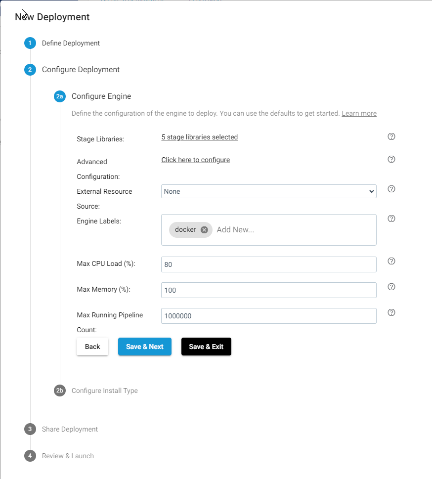
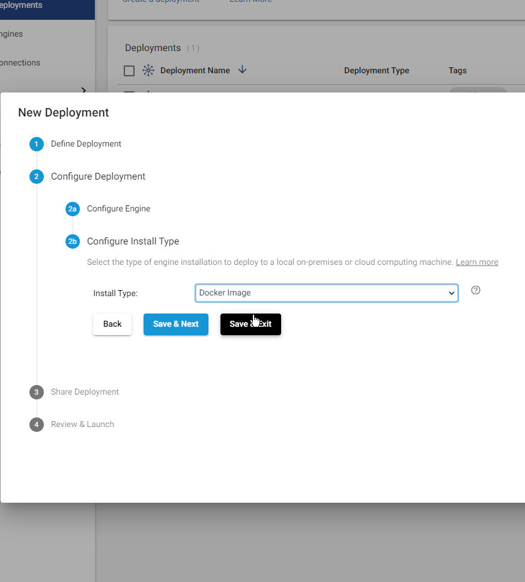
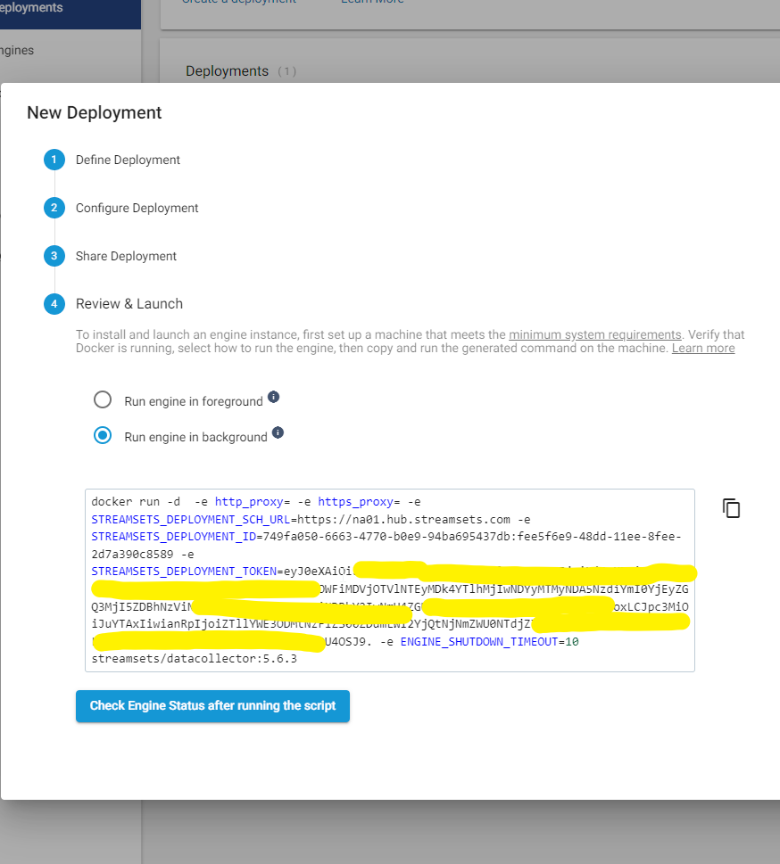
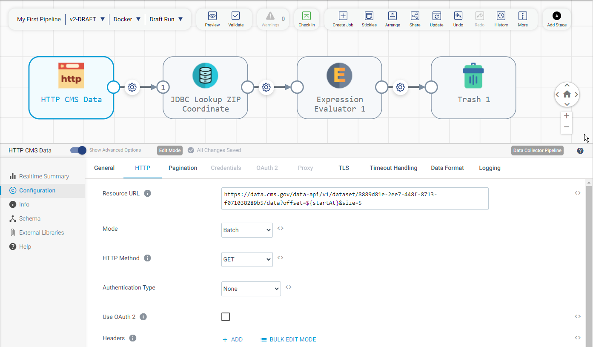
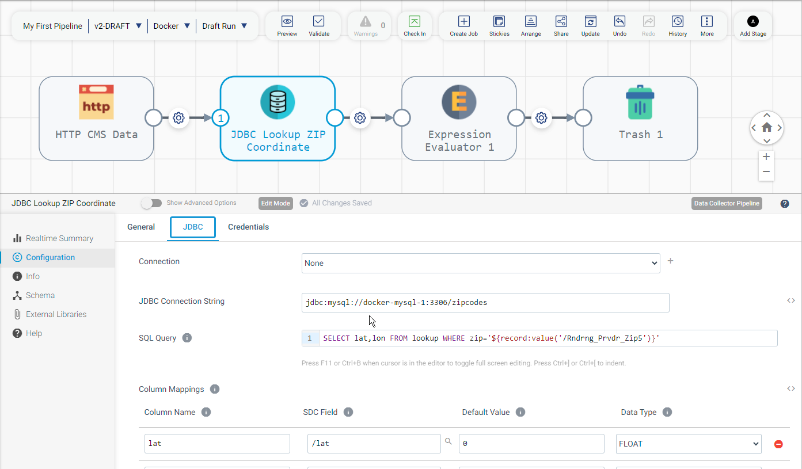
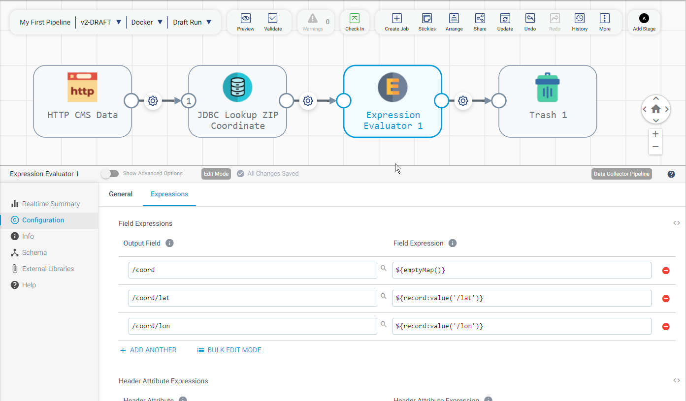
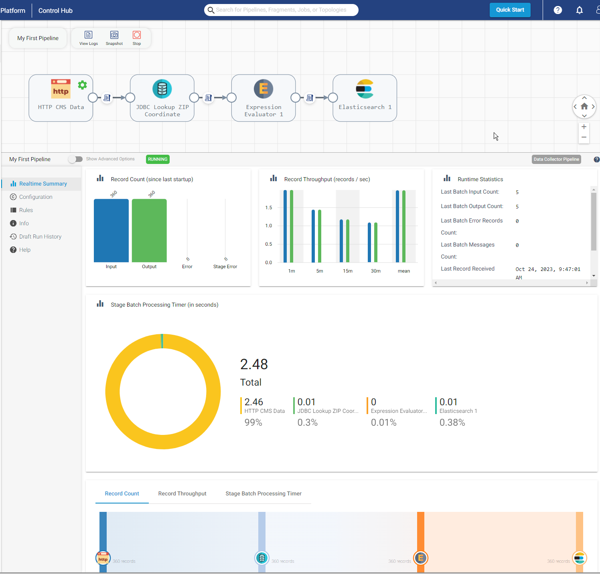

### 
Login to https://cloud.login.streamsets.com/login


Navigate to Set Up->Deployments

In the table click the `+` button to add a deployment. 

Select Self Managed 
Deployment Type -> Data Collector
Install Type -> Docker image 










## At the final step you will be shown the data script to launch the Docker container



We can put the token into a environment variable 
```shell
export STREAMSETS_DEPLOYMENT_TOKEN='eyJ0eXAiO.xyz...4OSJ9.'
```
and launch the script adding the network flag and name the deployment
```shell
docker run -d  -e http_proxy= -e https_proxy= \
 --name sdc
 --net elastic
 -e STREAMSETS_DEPLOYMENT_SCH_URL=https://na01.hub.streamsets.com \
 -e STREAMSETS_DEPLOYMENT_ID=749fa050-6663-4770-b0e9-94ba695437db:fee5f6e9-48dd-11ee-8fee-2d7a390c8589 \
 -e STREAMSETS_DEPLOYMENT_TOKEN=$STREAMSETS_DEPLOYMENT_TOKEN \
 -e ENGINE_SHUTDOWN_TIMEOUT=10 streamsets/datacollector:5.6.3

```
### Create or Upload Sample Pipelines
Navigate to Build->Pipelines and upload the pipeline file 
`MyFirstPipeline.json`

Here are some of the configurations for key stages of the pipeline.








## Certificate Steps

Copy the certificates from the elasticsearch deployment

Login to the container
```shell
docker exec -it sdc /bin/bash
```
The default keystore file and password file are  located at `/etc/sdc`
```shell
keytool    -list -keystore  keystore.jks
$ keytool    -list -keystore  keystore.jks 
```

### Running the pipeline 

 