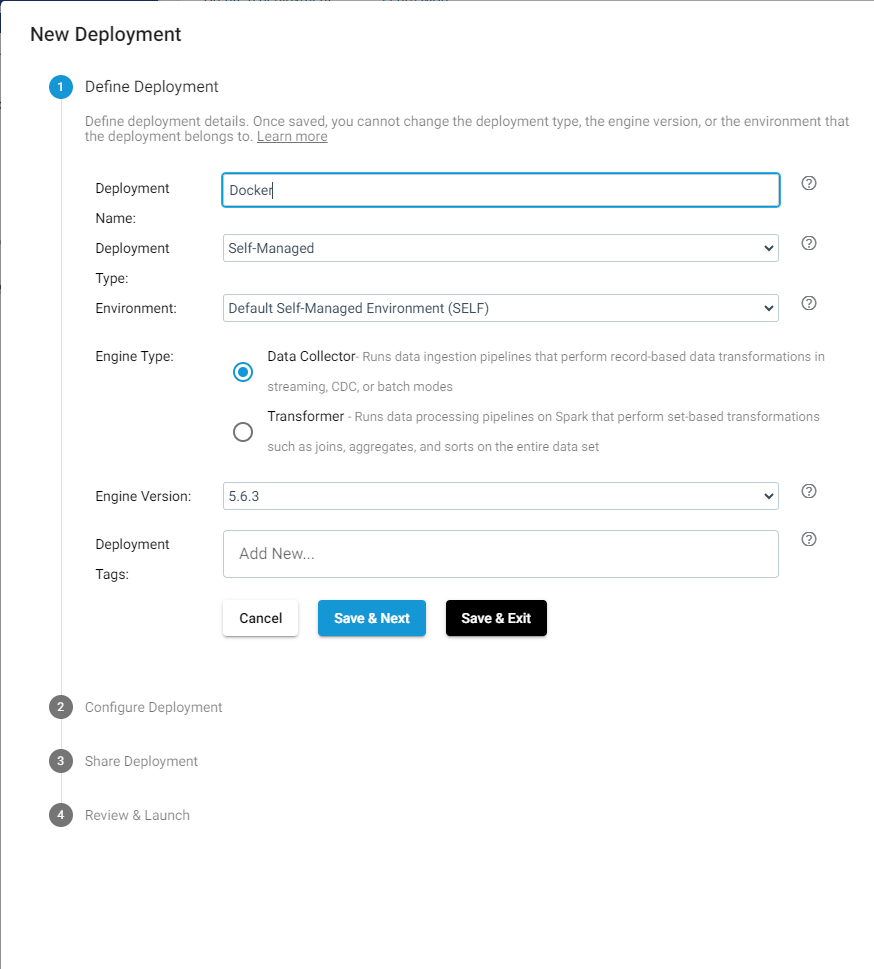
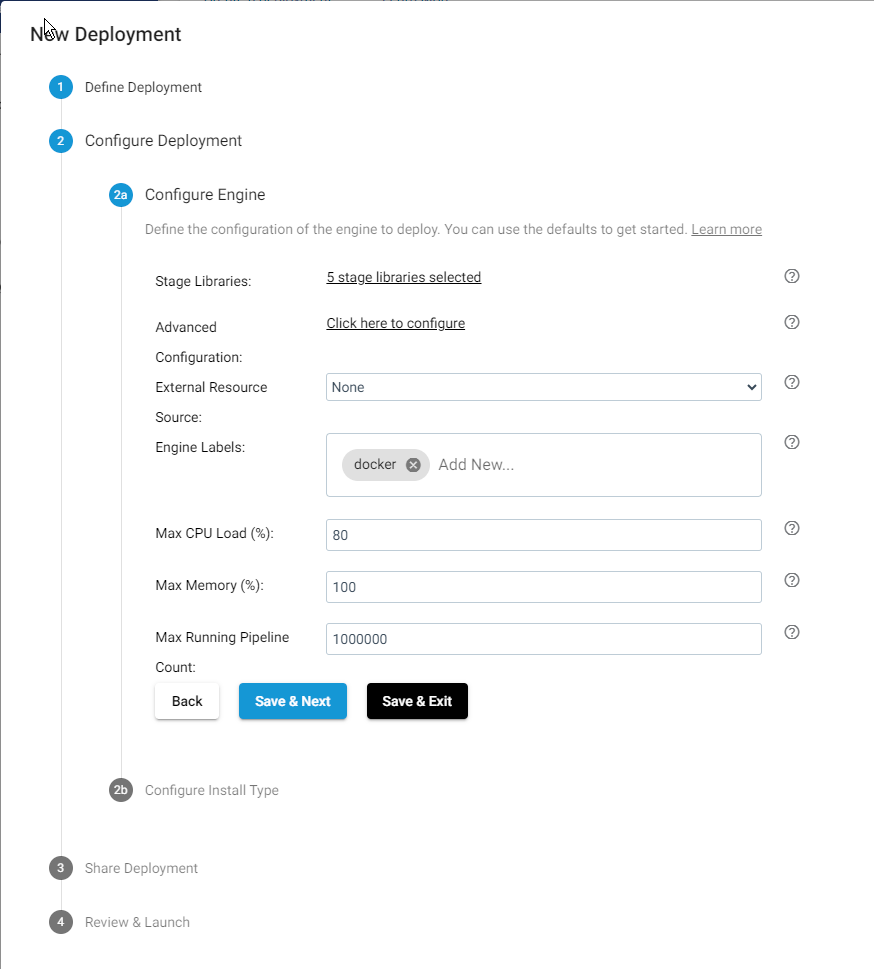
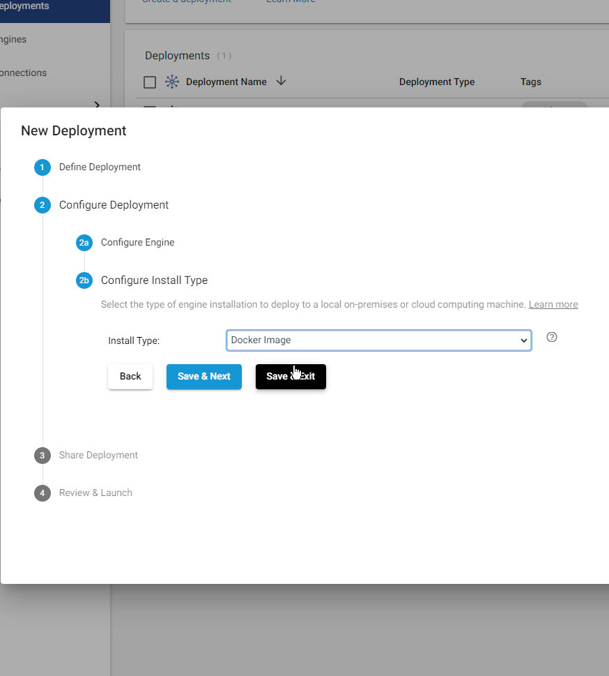
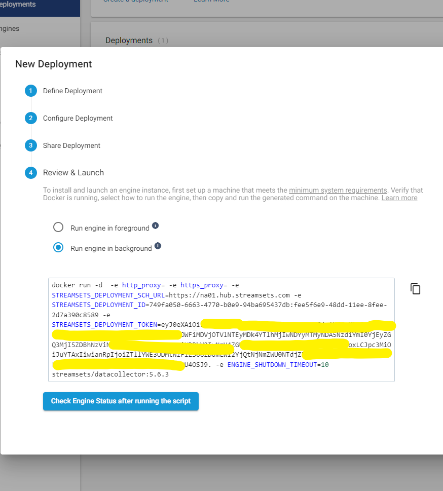

### 
Login to https://cloud.login.streamsets.com/login

Navigate to Set Up->Deployments

In the table click the `+` button to add a deployment. 

Select Self Managed 
Deployment Type -> Data Collector
Install Type -> Docker image 

## At the final step you will be shown the data script to launch the Docker container

### Create or Upload Sample Pipelines
Navigate to Build->Pipelines and upload the pipeline file 
`MyFirstPipeline.json`